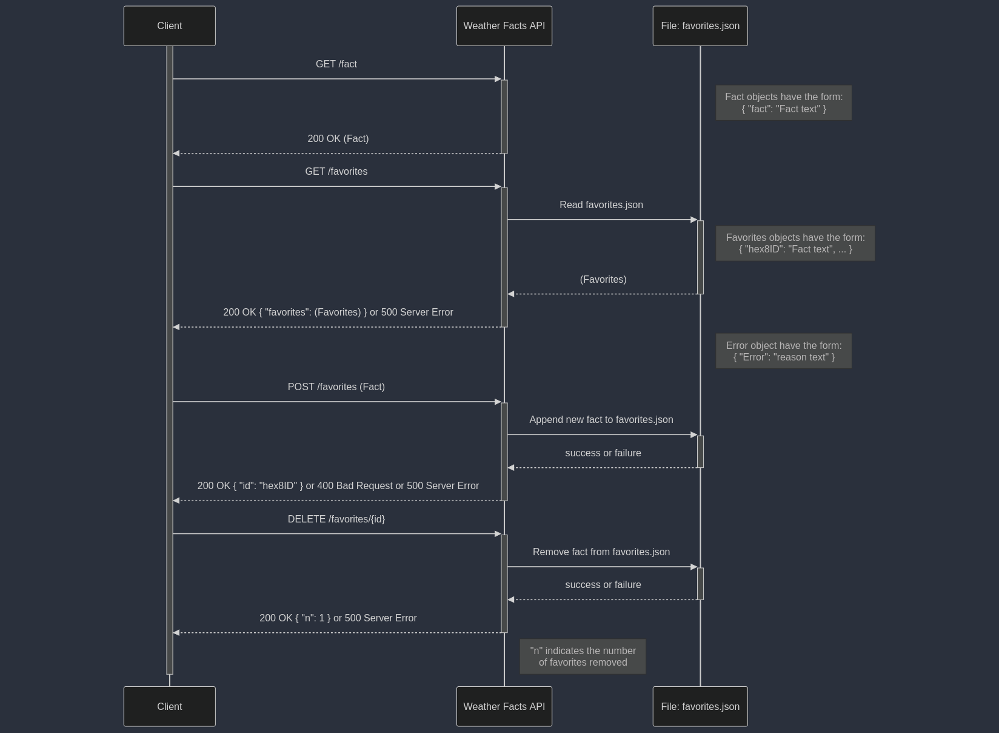

### 🌦️ Weather Facts API 🌦️

This project provides a simple API to handle the creation and saving of weather facts. 

The API exposes two endpoints `/fact` and `/favorites` that can be used to retrieve and save random weather facts.

---

### 📦 Requirements 📦
- `Python 3.0` or above.
- `pip` for installing dependencies.
### 🛠️ Installation 🛠️
```sh
git clone https://github.com/4475f9e4-1337-4c5b-bc13-6534b2c3a92d/weather_facts.git && cd weather_facts
```
### ⚙️ Build ⚙️
##### Using Makefile:
```sh
make build
```
##### Without Makefile:
###### For **Linux/macOS**:
```sh
python -m venv .venv
. .venv/bin/activate
pip install .
```
###### For **Windows**:
```sh
python -m venv .venv
. .venv/Scripts/activate
pip install .
```
---
### 🚀 Running the Server 🚀
##### Development:
To run the server in development mode:
```sh
./run.sh dev
``` 
or directly:
```sh
python server.py
```
##### Production:
To run the server in production mode using `waitress-serve`:
```sh
./run.sh
```
##### Custom Host/Port:
To specify a custom host and port, set the `HOST` and `PORT` environment variables:
```sh
HOST=0.0.0.0 PORT=8080 ./run.sh
```
---
### 📝 API Usage 📝
To interact with the API, clients should send HTTP requests to the appropriate endpoint while ensuring the correct headers are set. 

The `Accept: application/json` header should be included with all requests to indicate that the client expects a JSON-formatted response. For `POST` requests that include a JSON payload in the request body, the `Content-Type: application/json` header must also be set to inform the server of the data format. The APIs response will include a JSON body, which clients can parse to extract the returned data. See below code samples for usage and payloads expectations.

#### GET `/fact`
##### Get a random weather fact.

##### Code samples:
###### shell
```shell
curl -X GET http://localhost:5000/fact \
  -H 'Accept: application/json'
```
###### python
```python
import requests
headers = { 'Accept': 'application/json' }
r = requests.get('http://localhost:5000/fact', headers = headers)
print(r.json())
```

###### Responses
| Status | Meaning                                                                    | Description          | Body |
| ------ | -------------------------------------------------------------------------- | -------------------- | ---- |
| 200    | [OK](https://tools.ietf.org/html/rfc7231#section-6.3.1)                    | Successful operation | JSON |

##### Example Response:
###### 200 Response
```json

{ "fact": "A 2003 heatwave turned grapes to raisins before they were picked from the vine!" }
```

---
#### GET `/favorites`
##### Get all saved favorite weather facts.

##### Code samples:
###### shell
```shell
curl -X GET http://localhost:5000/favorites \
  -H 'Accept: application/json'
```
###### python
```python
import requests
headers = { 'Accept': 'application/json' }
r = requests.get('http://localhost:5000/favorites', headers = headers)
print(r.json())
```

###### Responses:
| Status | Meaning                                                                    | Description          | Body |
| ------ | -------------------------------------------------------------------------- | -------------------- | ---- |
| 200    | [OK](https://tools.ietf.org/html/rfc7231#section-6.3.1)                    | Successful operation | JSON |
| 500    | [Internal Server Error](https://tools.ietf.org/html/rfc7231#section-6.6.1) | Server error         | JSON |

##### Example Responses:
###### 200 Response
```json
{
  "favorites": {
    "9e6b2d09b197c310": "Some favorite fact",
    "673795abb85fb4db": "Another favorite fact"
  }
}
```

###### 500 Response
```json
{ "error": "Internal server error" }
```

---
#### POST `/favorites`
##### Save a weather fact to favorites.

##### Code samples:
###### shell
```shell
curl -X POST http://localhost:5000/favorites \
  -H 'Content-Type: application/json' \
  -H 'Accept: application/json' \
  -d '{ "fact": "My new favorite fact" }'
```
###### python
```python
import requests
headers = { 'Accept': 'application/json' }
data = { "fact": "My new favorite fact" }
r = requests.post('http://localhost:5000/favorites', headers = headers, json = data)
print(r.json())
```

###### Parameters:
|Name|In|Type|Required|Description|
|---|---|---|---|---|
|`fact`|body|JSON|true|an object with a `fact` property to save|

##### Example Body:
```json
{ "fact": "A 2003 heatwave turned grapes to raisins before they were picked from the vine!" }
```

###### Responses:
|Status|Meaning|Description|Body|
|---|---|---|---|
|200|[OK](https://tools.ietf.org/html/rfc7231#section-6.3.1)|Successful operation|JSON|
|400|[Bad Request](https://tools.ietf.org/html/rfc7231#section-6.5.1)|Body parameter incorrect|JSON|
|500|[Internal Server Error](https://tools.ietf.org/html/rfc7231#section-6.6.1)|Server error|JSON|

##### Example Responses:
###### 200 Response
```json
{ "id": "9e6b2d09b197c310" }
```

###### 400 Response
```json
{ "error": "Bad request" }
```

###### 500 Response
```json
{ "error": "Internal server error" }
```

---
#### DELETE `/favorites/{id}`
##### Delete a favorited fact by id.

##### Code samples:
###### shell
```shell
curl -X DELETE http://localhost:5000/favorites/9e6b2d09b197c310 \
  -H 'Accept: application/json'
```
###### python
```python
import requests
headers = { 'Accept': 'application/json' }
r = requests.delete('http://localhost:5000/favorites/9e6b2d09b197c310', headers = headers)
print(r.json())
```

###### Parameters:
| Name | In   | Type   | Required | Description              |
| ---- | ---- | ------ | -------- | ------------------------ |
| `id` | path | string | true     | id of the fact to delete |

###### Responses:
|Status|Meaning|Description|Body|
|---|---|---|---|
|200|[OK](https://tools.ietf.org/html/rfc7231#section-6.3.1)|Successful operation|JSON|
|500|[Internal Server Error](https://tools.ietf.org/html/rfc7231#section-6.6.1)|Server error|JSON|

##### Example Responses:
###### 200 Response

```json
{ "n": 1 } // n is the number of deleted facts
```

###### 500 Response
```json
{ "error": "Internal server error" }
```

---
### 📈 UML Sequence Diagram 📈
<p align="center">
  
</p>

